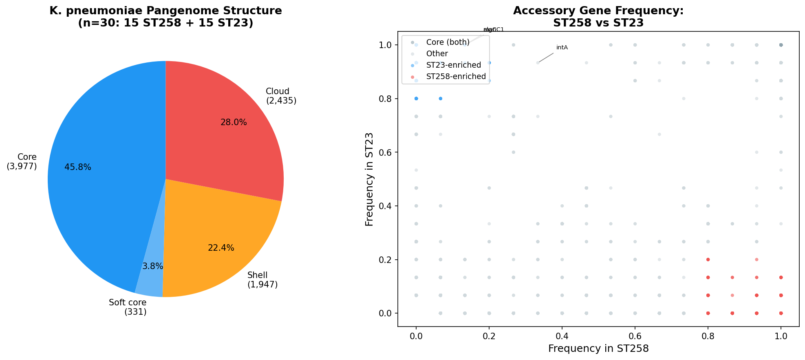
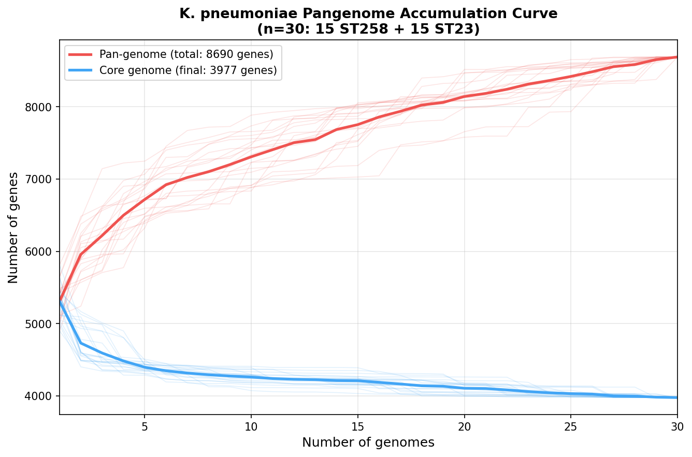

# Comparative Pangenome Analysis of Carbapenem-Resistant (ST258) and Hypervirulent (ST23) *Klebsiella pneumoniae*

**Author:** Pareekshya Devkota
**Institution:** Tri-Chandra Multiple Campus, Tribhuvan University, Kathmandu, Nepal
**Date:** July 2026
**License:** MIT

## Overview

*Klebsiella pneumoniae* has evolved two globally significant high-risk lineages with
divergent evolutionary strategies: ST258, the dominant carbapenem-resistant clone
producing KPC-type carbapenemases, and ST23, the classic hypervirulent clone associated
with community-acquired liver abscess and carrying virulence plasmids encoding aerobactin
and hypermucoviscosity regulators. This project builds a comparative pangenome of both
lineages to ask whether their divergent strategies — resistance vs. virulence — are
reflected in systematically different accessory genome content.

**Research question:** Does accessory genome composition differ between ST258 and ST23,
and do those differences localize to functionally coherent gene categories consistent
with each lineage's known biology?

## Dataset

- 30 complete genome assemblies: 15 ST258 + 15 ST23
- Source: NCBI RefSeq (assemblies only, not raw reads)
- ST verified by Kleborate v3 after download — accession labels were not trusted
- Accession list: `data/verified_accessions.txt`

## Key Findings

### Pangenome structure (n=30)

| Category | Genes | % of total |
|---|---|---|
| Core (≥99% strains) | 3,977 | 45.8% |
| Soft core (95–99%) | 331 | 3.8% |
| Shell (15–95%) | 1,947 | 22.4% |
| Cloud (<15%) | 2,435 | 28.0% |
| **Total pangenome** | **8,690** | — |

The large cloud genome (28%) is consistent with the known open pangenome of
*K. pneumoniae*, driven by extensive horizontal gene transfer and mobile element flux.

### ST258 vs ST23 accessory genome comparison

| Category | Genes |
|---|---|
| ST258-enriched (≥80% ST258, ≤20% ST23) | 476 |
| ST23-enriched (≥80% ST23, ≤20% ST258) | 451 |
| Core (both lineages) | 3,977 |

**ST258-enriched genes** are dominated by prophage integrase (*intA*), mobilization
proteins (*mobA*), and beta-lactamase genes (TEM-type), consistent with ST258's
well-documented plasmid-heavy, resistance-oriented accessory genome.

**ST23-enriched genes** are enriched for capsule biosynthesis (*algC*, *manC1*,
UDP-glucose transferase) and metabolic genes, consistent with ST23's hypervirulent
phenotype driven by an unusually thick polysaccharide capsule. IS66 and IS5 family
transposases were also enriched in ST23, suggesting active genome remodelling.

**Biological interpretation:** The accessory genome composition directly reflects each
lineage's evolutionary strategy — ST258 accumulates resistance and MGE-associated genes,
while ST23 maintains an expanded capsule biosynthesis repertoire. These findings are
consistent with published observations that convergent carbapenem resistance and
hypervirulence in *K. pneumoniae* arise largely from distinct genomic backgrounds.

## Figures



*Left: Pangenome structure across all 30 genomes. Right: Per-gene frequency in ST258
vs ST23; red = ST258-enriched, blue = ST23-enriched, grey = core or intermediate.*

## Pangenome accumulation curve



*The pan-genome (red) continues rising at n=30, consistent with an open pangenome — characteristic of K. pneumoniae's extensive horizontal gene transfer capacity. The core genome (blue) rapidly stabilises, indicating a conserved functional backbone across both lineages.*

## Pipeline

| Step | Tool | Version | Purpose |
|---|---|---|---|
| Genome download | NCBI datasets CLI | 18.33.1 | Assembly download (no raw reads) |
| ST verification | Kleborate | v3 | K. pneumoniae-specific typing + AMR/virulence scoring |
| Annotation | Prokka | 1.14.6 | Consistent gene annotation across all genomes |
| Pangenome | Panaroo | 1.3.4 | Core/accessory/cloud gene classification |
| Comparative analysis | Python (pandas) | 3.10 | ST258 vs ST23 accessory gene frequency |
| Visualization | matplotlib | — | Pangenome pie chart + frequency scatter plot |

## Reproducibility

Genome assemblies are excluded from git (see `.gitignore`) — regenerate via:

```bash
conda env create -f environment.yml
conda activate kp-pangenome
# Download verified genomes
while IFS=$'\t' read -r ACC ST; do
    datasets download genome accession "$ACC" --include genome \
        --filename "data/genomes/confirmed/${ACC}.zip"
    unzip -o "data/genomes/confirmed/${ACC}.zip" \
        -d "data/genomes/confirmed/${ACC}_tmp" > /dev/null
    find "data/genomes/confirmed/${ACC}_tmp" -name "*.fna" \
        -exec mv {} "data/genomes/confirmed/${ACC}_${ST}.fna" \;
    rm -rf "data/genomes/confirmed/${ACC}_tmp" \
           "data/genomes/confirmed/${ACC}.zip"
done < data/verified_accessions.txt
```

Then run annotation and pangenome:
```bash
bash pangenome/scripts/run_pangenome.sh
python pangenome/scripts/compare_st_accessory.py
python pangenome/scripts/plot_pangenome.py
```

**Computational environment:**
- OS: Ubuntu 22.04 LTS (WSL2 on Windows 11)
- Hardware: 8 CPU cores, 15.7 GB RAM
- Package management: Miniconda (miniforge3)

## Repository Structure
KP-pangenome-analysis/
├── data/
│   ├── verified_accessions.txt     # 30 ST-verified accessions
│   └── all_kp_refseq_complete.txt  # Full RefSeq accession list (query only)
├── metadata/
│   └── isolate_metadata.tsv        # ST, country, year per genome
├── annotations/                    # Prokka outputs (gitignored)
├── pangenome/
│   ├── scripts/                    # All analysis scripts
│   └── results/                    # Panaroo + Kleborate outputs
└── results/
├── ST258_enriched_genes.csv
├── ST23_enriched_genes.csv
└── figures/
└── pangenome_comparison.png

## Citation

If you use this repository, please cite:

Devkota P. (2026). Comparative pangenome analysis of carbapenem-resistant (ST258) and
hypervirulent (ST23) *Klebsiella pneumoniae*. GitHub.
https://github.com/devkotapareekshya/KP-pangenome-analysis

## Contact

Pareekshya Devkota
devkotapareekshya08@gmail.com
ORCID: 0009-0003-8645-0626
Tri-Chandra Multiple Campus, Tribhuvan University, Kathmandu, Nepal

